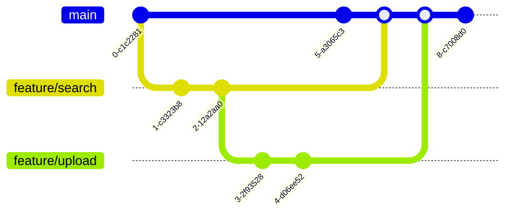

Этот проект предоставляет функционал для работы с репозиторием 3D моделей, включая поиск, загрузку, хранение и управление правами пользователей. Основные компоненты системы описаны ниже.

# Основные возможности

- Конвертация моделей: Поддержка различных форматов для удобной работы с 3D моделями.
- Поиск моделей: Быстрый и удобный поиск по ключевым словам и категориям.
- Хранение моделей: Надежное и структурированное хранение данных.
- Управление пользователями: Регистрация, авторизация и управление профилями пользователей.
- Управление правами: Настройка доступа к моделям и действиям.
- Уведомления: Оповещения пользователей о завершении загрузок и других событиях.

# Карта проекта

# Путешествие пользователя

# История разработки

# Квадрант технологий и функций

